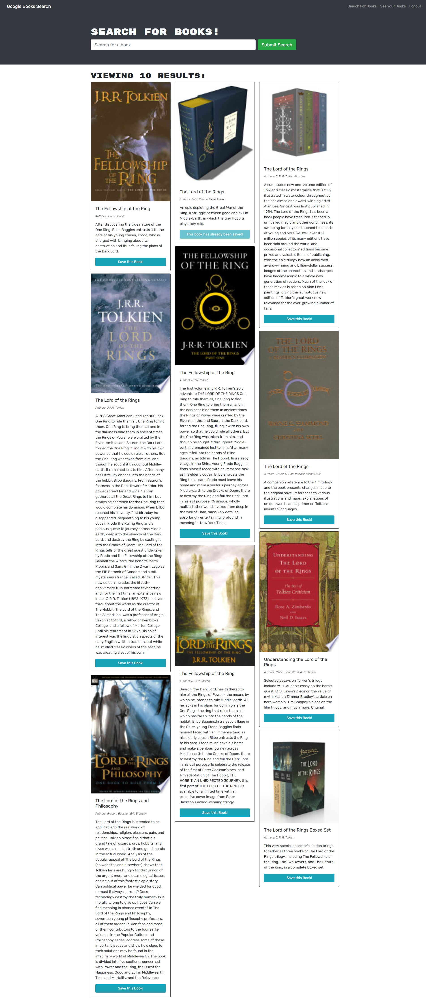
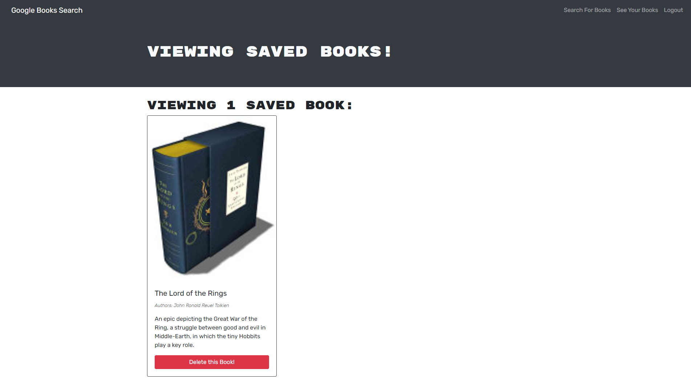

# MERN : Book Search Engine

## Purpose

The purpose of this project was to create a functional book search app and convert it from using a RESTful API to using a GraphQL API using Apollo Server. 

Some features of the app are:

- When the user first loads the page they are able to search the google API for book titles:
- When a user creates an account they are able to save books to their profile. 
- When a user navigates to their saved books page they are able to view all of the books they have saved to their profile.
- Users are able to delete books from their profile.  

The application can be found at: https://intense-forest-13246.herokuapp.com/

---

## Appearance

### Here is an example of the landing page on first visit:

### Here is an example of a user with a book saved:

### Here is an example of a user viewing their saved books:

